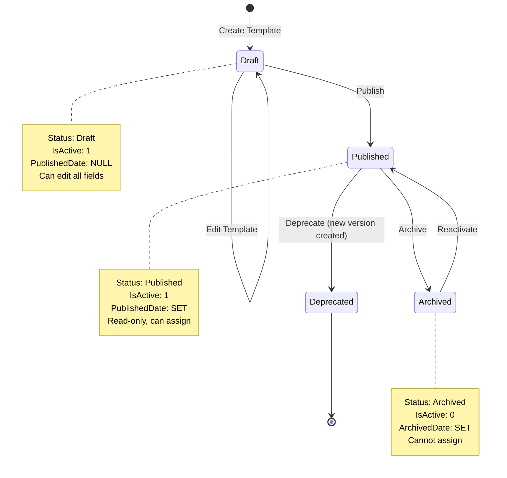
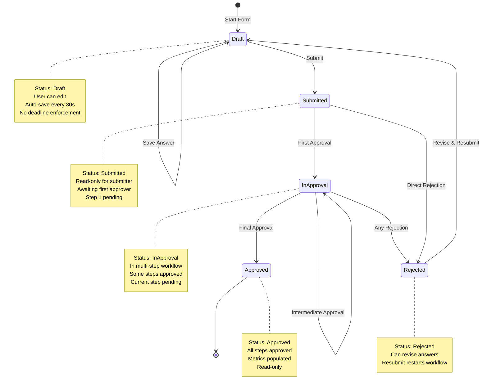
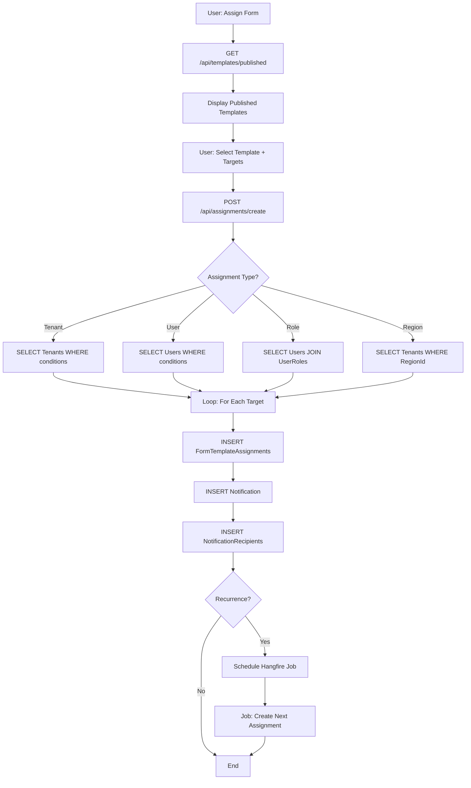
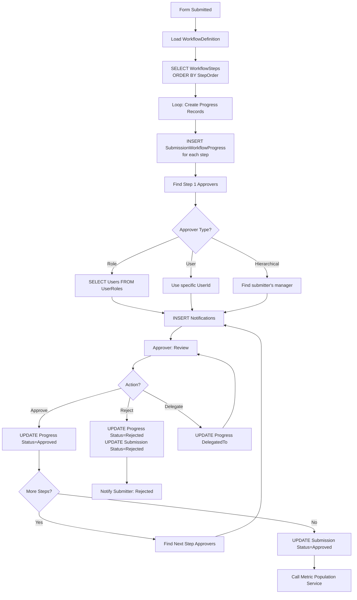
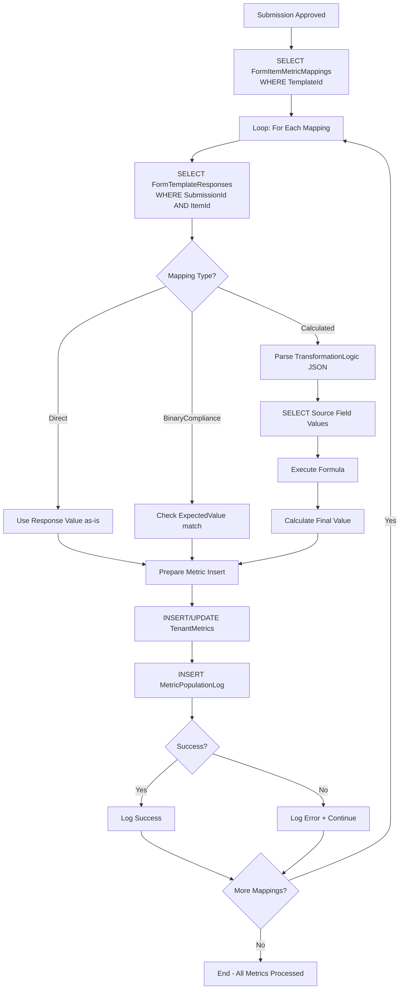

# Section 4: Form Templates & Submissions - Data Flow Diagrams

**Purpose:** Visual representation of data flow through the form system  
**Prerequisite:** Read `0_Section4_Workflows_Actions.md` first

---

## Table of Contents

1. [Template Lifecycle State Machine](#template-lifecycle-state-machine)
2. [Submission Lifecycle State Machine](#submission-lifecycle-state-machine)
3. [Template Creation Data Flow](#template-creation-data-flow)
4. [Form Assignment Data Flow](#form-assignment-data-flow)
5. [Form Submission Data Flow](#form-submission-data-flow)
6. [Approval Workflow Data Flow](#approval-workflow-data-flow)
7. [Metric Population Data Flow](#metric-population-data-flow)
8. [Database Query Patterns](#database-query-patterns)
9. [API Endpoint Structure](#api-endpoint-structure)

---

## Template Lifecycle State Machine



**State Transitions:**

| From | To | Trigger | Database Update |
|------|----|---------|--------------------|
| New | Draft | Create Template | `INSERT FormTemplates, PublishStatus='Draft'` |
| Draft | Published | Publish Button | `UPDATE PublishStatus='Published', PublishedDate=NOW()` |
| Published | Archived | Archive Button | `UPDATE PublishStatus='Archived', ArchivedDate=NOW()` |
| Published | Deprecated | Create New Version | `UPDATE PublishStatus='Deprecated', CREATE new v2` |
| Archived | Published | Reactivate Button | `UPDATE PublishStatus='Published', IsActive=1` |

---

## Submission Lifecycle State Machine



**State Transitions:**

| From | To | Trigger | Database Update | Side Effects |
|------|----|---------|--------------------|--------------|
| New | Draft | Start Form | `INSERT FormTemplateSubmissions, Status='Draft'` | Create submission record |
| Draft | Submitted | Submit Button | `UPDATE Status='Submitted', SubmittedDate=NOW()` | Create workflow progress, notify approvers |
| Submitted | InApproval | First Approval | `UPDATE Status='InApproval'` | Update step 1 progress |
| InApproval | Approved | Last Approval | `UPDATE Status='Approved'` | Populate metrics, notify submitter |
| Submitted/InApproval | Rejected | Reject Button | `UPDATE Status='Rejected'` | Notify submitter with comments |
| Rejected | Draft | Revise | `UPDATE Status='Draft'` | Allow editing |

---

## Template Creation Data Flow

```mermaid
flowchart TD
    A[User: Create Template] --> B[POST /api/templates/create]
    B --> C{Validate Input}
    C -->|Invalid| D[Return 400 Error]
    C -->|Valid| E[INSERT FormTemplates]
    E --> F[Return TemplateId]
    F --> G[User: Add Section]
    G --> H[POST /api/templates/{id}/sections]
    H --> I[INSERT FormTemplateSections]
    I --> J[Return SectionId]
    J --> K[User: Add Field]
    K --> L[POST /api/templates/{id}/sections/{sectionId}/fields]
    L --> M{Field Type?}
    M -->|Dropdown| N[INSERT FormTemplateItems<br/>+ FormItemOptions]
    M -->|Other| O[INSERT FormTemplateItems]
    N --> P[User: Add Validation]
    O --> P
    P --> Q[POST /api/templates/{id}/fields/{fieldId}/validations]
    Q --> R[INSERT FormItemValidations]
    R --> S[User: Map to Metric]
    S --> T[POST /api/templates/{id}/fields/{fieldId}/metrics]
    T --> U[INSERT FormItemMetricMappings]
    U --> V[User: Publish]
    V --> W[POST /api/templates/{id}/publish]
    W --> X{Validation Check}
    X -->|Fail| Y[Return 400 with errors]
    X -->|Pass| Z[UPDATE PublishStatus='Published']
    Z --> AA[Template Ready for Assignment]
```

**Tables Affected (in order):**
1. `FormTemplates`
2. `FormTemplateSections`
3. `FormTemplateItems`
4. `FormItemOptions` (if dropdown)
5. `FormItemValidations`
6. `FormItemMetricMappings`

**Validation Rules:**
- Template name unique within category
- Template code globally unique
- At least 1 section before publish
- At least 1 field before publish
- If `RequiresApproval=true`, must have `WorkflowId`

---

## Form Assignment Data Flow



**Assignment Resolution Logic:**

**Tenant-Based Assignment:**
```sql
-- Find all active factories in Region 1
SELECT TenantId
FROM Tenants
WHERE TenantType = 'Factory'
  AND RegionId = @RegionId
  AND IsActive = 1
```

**Role-Based Assignment:**
```sql
-- Find all users with ICT Officer role
SELECT DISTINCT u.UserId
FROM Users u
INNER JOIN UserRoles ur ON u.UserId = ur.UserId
INNER JOIN Roles r ON ur.RoleId = r.RoleId
WHERE r.RoleCode = 'ICT_OFFICER'
  AND u.IsActive = 1
```

**Notification Creation:**
```sql
-- Create notification for each assigned user
INSERT INTO Notifications (NotificationType, Title, Message, ...)
SELECT
    'FormAssigned',
    'New Form Assigned: ' + @TemplateName,
    'Complete by ' + CAST(@DueDate AS NVARCHAR),
    ...
FROM FormTemplateAssignments
WHERE AssignmentId = @NewAssignmentId
```

---

## Form Submission Data Flow

```mermaid
flowchart TD
    A[User: View Assigned Forms] --> B[GET /api/forms/assigned]
    B --> C{Query Assignments}
    C --> D[JOIN FormTemplateAssignments<br/>LEFT JOIN FormTemplateSubmissions]
    D --> E[Return: Pending, InProgress, Submitted]
    E --> F[User: Start Form]
    F --> G[GET /api/forms/start/{assignmentId}]
    G --> H{Submission Exists?}
    H -->|No| I[INSERT FormTemplateSubmissions<br/>Status=Draft]
    H -->|Yes| J[SELECT existing submission]
    I --> K[GET /api/templates/{id}/structure]
    J --> K
    K --> L[Return: Sections, Fields, Validations]
    L --> M[Render Form UI]
    M --> N[User: Fill Field]
    N --> O[Auto-save Timer: 30s]
    O --> P[POST /api/submissions/{id}/responses]
    P --> Q{Validate Field}
    Q -->|Fail| R[Return validation error]
    Q -->|Pass| S[MERGE FormTemplateResponses]
    S --> T[UPDATE FormTemplateSubmissions.ModifiedDate]
    T --> U{More Fields?}
    U -->|Yes| N
    U -->|No| V[User: Submit]
    V --> W[POST /api/submissions/{id}/submit]
    W --> X{Validate All Fields}
    X -->|Fail| Y[Return missing/invalid fields]
    X -->|Pass| Z[UPDATE Status=Submitted]
    Z --> AA[Trigger Approval Workflow]
    AA --> AB[Call Metric Population]
```

**Response Storage (EAV Pattern):**

```sql
-- Upsert response for each field
MERGE FormTemplateResponses AS target
USING (SELECT @SubmissionId, @ItemId) AS source (SubmissionId, ItemId)
ON target.SubmissionId = source.SubmissionId
   AND target.ItemId = source.ItemId
WHEN MATCHED THEN
    UPDATE SET
        TextValue = CASE WHEN @DataType IN ('Text', 'TextArea', 'Dropdown') THEN @Value ELSE NULL END,
        NumericValue = CASE WHEN @DataType = 'Number' THEN CAST(@Value AS DECIMAL) ELSE NULL END,
        DateValue = CASE WHEN @DataType = 'Date' THEN CAST(@Value AS DATE) ELSE NULL END,
        BooleanValue = CASE WHEN @DataType = 'Boolean' THEN CAST(@Value AS BIT) ELSE NULL END,
        ModifiedDate = GETUTCDATE()
WHEN NOT MATCHED THEN
    INSERT (SubmissionId, ItemId, TextValue, NumericValue, DateValue, BooleanValue, CreatedDate)
    VALUES (@SubmissionId, @ItemId, @TextValue, @NumericValue, @DateValue, @BooleanValue, GETUTCDATE());
```

**Conditional Logic Evaluation (Client-Side JavaScript):**

```javascript
// Evaluate conditional logic when source field changes
function evaluateConditionalLogic(sourceItemId, value) {
    // Find all fields that depend on this source field
    const dependentFields = fields.filter(f => 
        f.conditionalLogic?.rules.some(r => r.itemId === sourceItemId)
    );
    
    dependentFields.forEach(field => {
        const logic = JSON.parse(field.conditionalLogic);
        const shouldShow = logic.rules.every(rule => {
            if (rule.operator === 'equals') return value === rule.value;
            if (rule.operator === 'not_equals') return value !== rule.value;
            // ... other operators
        });
        
        if (logic.action === 'show') {
            document.getElementById(`field_${field.itemId}`).style.display = shouldShow ? 'block' : 'none';
        }
    });
}
```

---

## Approval Workflow Data Flow



**Workflow Step Resolution:**

**Find Current Pending Step:**
```sql
-- Get next pending step for submission
SELECT TOP 1 wp.*
FROM SubmissionWorkflowProgress wp
INNER JOIN WorkflowSteps ws ON wp.StepId = ws.StepId
WHERE wp.SubmissionId = @SubmissionId
  AND wp.Status = 'Pending'
ORDER BY ws.StepOrder ASC
```

**Find Approvers for Step:**
```sql
-- Role-based approver
SELECT DISTINCT u.UserId, u.Email, u.FirstName, u.LastName
FROM Users u
INNER JOIN UserRoles ur ON u.UserId = ur.UserId
WHERE ur.RoleId = @StepApproverRoleId
  AND u.IsActive = 1

-- User-specific approver
SELECT UserId, Email, FirstName, LastName
FROM Users
WHERE UserId = @StepApproverUserId
  AND IsActive = 1
```

**Update Workflow Progress:**
```sql
-- Approve current step
UPDATE SubmissionWorkflowProgress
SET Status = 'Approved',
    ReviewedBy = @CurrentUserId,
    ReviewedDate = GETUTCDATE(),
    Comments = @ApprovalComments
WHERE ProgressId = @ProgressId

-- Check if all steps approved
DECLARE @AllApproved BIT = (
    SELECT CASE WHEN COUNT(*) = 0 THEN 1 ELSE 0 END
    FROM SubmissionWorkflowProgress
    WHERE SubmissionId = @SubmissionId
      AND Status != 'Approved'
)

-- If all approved, update submission
IF @AllApproved = 1
BEGIN
    UPDATE FormTemplateSubmissions
    SET Status = 'Approved'
    WHERE SubmissionId = @SubmissionId
    
    -- Trigger metric population
    EXEC PopulateMetricsFromSubmission @SubmissionId
END
```

---

## Metric Population Data Flow



**Direct Mapping:**
```sql
-- Insert metric directly from field value
INSERT INTO TenantMetrics (
    TenantId, MetricId, ReportingPeriod,
    NumericValue, SourceType, SourceReferenceId, CapturedDate
)
SELECT
    s.TenantId,
    m.MetricId,
    s.ReportingPeriod,
    r.NumericValue, -- Direct copy
    'UserInput',
    s.SubmissionId,
    GETUTCDATE()
FROM FormTemplateSubmissions s
INNER JOIN FormTemplateResponses r ON s.SubmissionId = r.SubmissionId
INNER JOIN FormItemMetricMappings m ON r.ItemId = m.ItemId
WHERE s.SubmissionId = @SubmissionId
  AND m.MappingType = 'Direct'
```

**Calculated Mapping:**
```sql
-- Example: Uptime % = (operational / total) * 100
-- Formula JSON: {"formula": "(item21 / item20) * 100", "items": [21, 20]}

DECLARE @Operational DECIMAL(18,4), @Total DECIMAL(18,4)

SELECT @Operational = NumericValue
FROM FormTemplateResponses
WHERE SubmissionId = @SubmissionId AND ItemId = 21

SELECT @Total = NumericValue
FROM FormTemplateResponses
WHERE SubmissionId = @SubmissionId AND ItemId = 20

DECLARE @CalculatedValue DECIMAL(18,4) = (@Operational / NULLIF(@Total, 0)) * 100

INSERT INTO TenantMetrics (TenantId, MetricId, ReportingPeriod, NumericValue, SourceType, SourceReferenceId)
VALUES (@TenantId, @MetricId, @ReportingPeriod, @CalculatedValue, 'SystemCalculated', @SubmissionId)

-- Log calculation
INSERT INTO MetricPopulationLog (
    SubmissionId, MetricId, MappingId, SourceItemId,
    SourceValue, CalculatedValue, CalculationFormula, Status
)
VALUES (
    @SubmissionId, @MetricId, @MappingId, 21,
    CAST(@Operational AS NVARCHAR) + ' / ' + CAST(@Total AS NVARCHAR),
    @CalculatedValue,
    '(operational / total) * 100',
    'Success'
)
```

**Binary Compliance Mapping:**
```sql
-- Check if answer matches expected value
-- Example: "Is LAN working?" Expected: "Yes" → Compliance = 100%

DECLARE @Answer NVARCHAR(MAX), @Expected NVARCHAR(100), @Compliance DECIMAL(18,4)

SELECT @Answer = TextValue
FROM FormTemplateResponses
WHERE SubmissionId = @SubmissionId AND ItemId = @ItemId

SELECT @Expected = ExpectedValue
FROM FormItemMetricMappings
WHERE MappingId = @MappingId

SET @Compliance = CASE WHEN @Answer = @Expected THEN 100.00 ELSE 0.00 END

INSERT INTO TenantMetrics (TenantId, MetricId, ReportingPeriod, NumericValue, SourceType)
VALUES (@TenantId, @MetricId, @ReportingPeriod, @Compliance, 'ComplianceTracking')
```

---

## Database Query Patterns

### Pattern 1: Get Assigned Forms for User

```sql
SELECT
    a.AssignmentId,
    t.TemplateId,
    t.TemplateName,
    t.Description,
    t.TemplateType,
    a.AssignedDate,
    a.DueDate,
    DATEDIFF(DAY, GETUTCDATE(), a.DueDate) AS DaysUntilDue,
    s.SubmissionId,
    s.Status AS SubmissionStatus,
    s.ModifiedDate AS LastSavedDate,
    CASE
        WHEN s.Status = 'Draft' THEN 'In Progress'
        WHEN s.Status IN ('Submitted', 'InApproval') THEN 'Submitted'
        WHEN s.Status = 'Approved' THEN 'Approved'
        WHEN s.Status = 'Rejected' THEN 'Rejected'
        WHEN a.DueDate < GETUTCDATE() THEN 'Overdue'
        ELSE 'Pending'
    END AS DisplayStatus
FROM FormTemplateAssignments a
INNER JOIN FormTemplates t ON a.TemplateId = t.TemplateId
LEFT JOIN FormTemplateSubmissions s
    ON s.TemplateId = t.TemplateId
    AND s.ReportingPeriod = a.AssignedDate
    AND (
        (a.AssignmentType = 'Tenant' AND s.TenantId = a.TenantId)
        OR
        (a.AssignmentType = 'User' AND s.SubmittedBy = @CurrentUserId)
    )
WHERE a.IsActive = 1
  AND t.PublishStatus = 'Published'
  AND (
    (a.AssignmentType = 'Tenant' AND a.TenantId = @CurrentUserTenantId)
    OR
    (a.AssignmentType = 'User' AND a.UserId = @CurrentUserId)
    OR
    (a.AssignmentType = 'Role' AND EXISTS (
        SELECT 1 FROM UserRoles WHERE UserId = @CurrentUserId AND RoleId = a.RoleId
    ))
  )
ORDER BY
    CASE WHEN s.Status = 'Draft' THEN 1 ELSE 2 END,
    a.DueDate ASC
```

### Pattern 2: Get Form Structure for Submission

```sql
-- Get template with sections and fields
SELECT
    t.TemplateId,
    t.TemplateName,
    t.Description,
    s.SectionId,
    s.SectionName,
    s.SectionDescription,
    s.DisplayOrder AS SectionOrder,
    i.ItemId,
    i.ItemCode,
    i.ItemName,
    i.DataType,
    i.IsRequired,
    i.PlaceholderText,
    i.HelpText,
    i.ConditionalLogic,
    i.DisplayOrder AS FieldOrder,
    (
        SELECT
            OptionId, OptionValue, OptionLabel, DisplayOrder, IsDefault
        FROM FormItemOptions
        WHERE ItemId = i.ItemId AND IsActive = 1
        ORDER BY DisplayOrder
        FOR JSON PATH
    ) AS FieldOptions,
    (
        SELECT
            ValidationType, MinValue, MaxValue, MinLength, MaxLength,
            RegexPattern, ErrorMessage, Severity
        FROM FormItemValidations
        WHERE ItemId = i.ItemId AND IsActive = 1
        ORDER BY ValidationOrder
        FOR JSON PATH
    ) AS Validations
FROM FormTemplates t
INNER JOIN FormTemplateSections s ON t.TemplateId = s.TemplateId
INNER JOIN FormTemplateItems i ON s.SectionId = i.SectionId
WHERE t.TemplateId = @TemplateId
  AND s.IsActive = 1
  AND i.IsActive = 1
ORDER BY s.DisplayOrder, i.DisplayOrder
```

### Pattern 3: Get Pending Approvals for User

```sql
SELECT
    s.SubmissionId,
    t.TemplateName,
    tenant.TenantName,
    submitter.FirstName + ' ' + submitter.LastName AS SubmittedBy,
    s.SubmittedDate,
    DATEDIFF(DAY, s.SubmittedDate, GETUTCDATE()) AS DaysPending,
    wp.StepId,
    ws.StepName,
    wp.DueDate,
    CASE
        WHEN wp.DueDate < GETUTCDATE() THEN 1
        ELSE 0
    END AS IsOverdue
FROM FormTemplateSubmissions s
INNER JOIN FormTemplates t ON s.TemplateId = t.TemplateId
LEFT JOIN Tenants tenant ON s.TenantId = tenant.TenantId
INNER JOIN Users submitter ON s.SubmittedBy = submitter.UserId
INNER JOIN SubmissionWorkflowProgress wp ON s.SubmissionId = wp.SubmissionId
INNER JOIN WorkflowSteps ws ON wp.StepId = ws.StepId
WHERE s.Status IN ('Submitted', 'InApproval')
  AND wp.Status = 'Pending'
  AND (
    -- Role-based approver
    (ws.ApproverRoleId IS NOT NULL AND EXISTS (
        SELECT 1 FROM UserRoles WHERE UserId = @CurrentUserId AND RoleId = ws.ApproverRoleId
    ))
    OR
    -- User-specific approver
    (ws.ApproverUserId = @CurrentUserId)
    OR
    -- Delegated to current user
    (wp.DelegatedTo = @CurrentUserId)
  )
ORDER BY
    CASE WHEN wp.DueDate < GETUTCDATE() THEN 0 ELSE 1 END, -- Overdue first
    s.SubmittedDate ASC -- Oldest first
```

---

## API Endpoint Structure

### Template Management

```
POST   /api/templates/create                    - Create new template
GET    /api/templates/{id}                       - Get template details
PUT    /api/templates/{id}                       - Update template (draft only)
POST   /api/templates/{id}/publish               - Publish template
POST   /api/templates/{id}/archive               - Archive template
GET    /api/templates/published                  - List published templates

POST   /api/templates/{id}/sections              - Add section
PUT    /api/templates/{id}/sections/{sectionId}  - Update section
DELETE /api/templates/{id}/sections/{sectionId}  - Delete section

POST   /api/templates/{id}/sections/{sectionId}/fields  - Add field
PUT    /api/templates/{id}/fields/{fieldId}             - Update field
DELETE /api/templates/{id}/fields/{fieldId}             - Delete field

POST   /api/templates/{id}/fields/{fieldId}/validations - Add validation
POST   /api/templates/{id}/fields/{fieldId}/metrics     - Map to metric
```

### Assignment Management

```
POST   /api/assignments/create        - Create assignment
GET    /api/assignments/{id}           - Get assignment details
GET    /api/assignments/compliance     - Get completion report
DELETE /api/assignments/{id}           - Cancel assignment
```

### Form Submission

```
GET    /api/forms/assigned                     - Get assigned forms for current user
POST   /api/forms/start/{assignmentId}         - Start new submission
GET    /api/submissions/{id}                   - Get submission with responses
POST   /api/submissions/{id}/responses         - Save field response (auto-save)
PUT    /api/submissions/{id}/responses/bulk    - Save multiple responses
POST   /api/submissions/{id}/submit            - Submit form for approval
POST   /api/submissions/{id}/files             - Upload file attachment
```

### Approval Workflow

```
GET    /api/approvals/pending          - Get pending approvals for current user
GET    /api/approvals/{submissionId}   - Get submission for review
POST   /api/approvals/{progressId}/approve   - Approve current step
POST   /api/approvals/{progressId}/reject    - Reject submission
POST   /api/approvals/{progressId}/delegate  - Delegate to another user
```

---

**Status:** ✅ Data Flow Documented  
**Next Document:** Implementation Roadmap  
**Use Case:** Reference for developers building API endpoints and database queries
